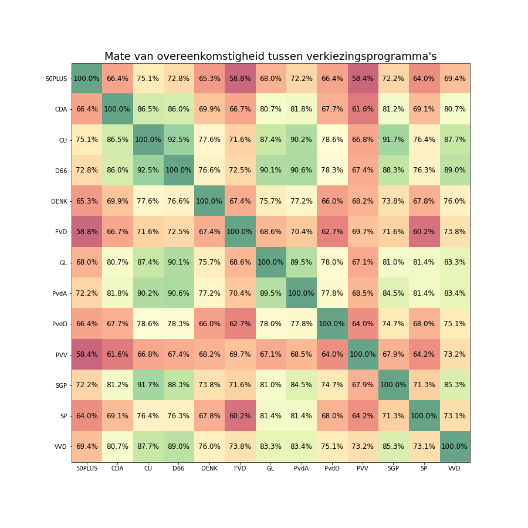
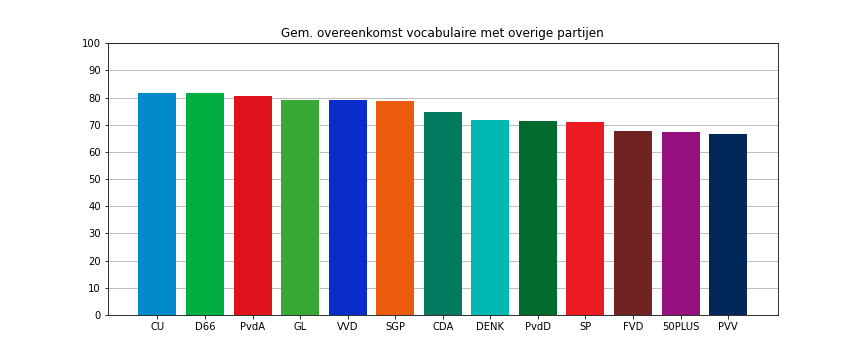
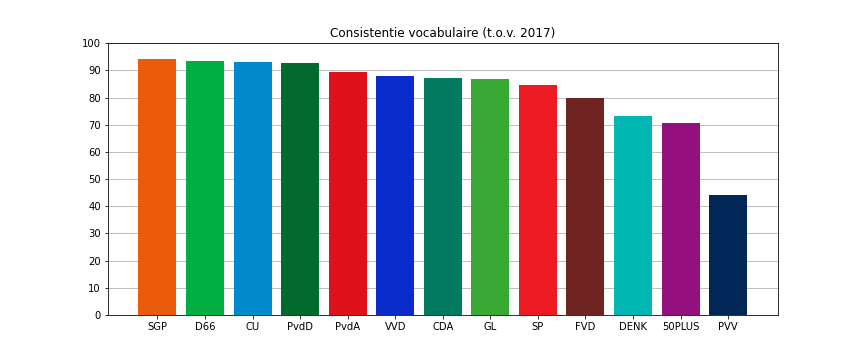
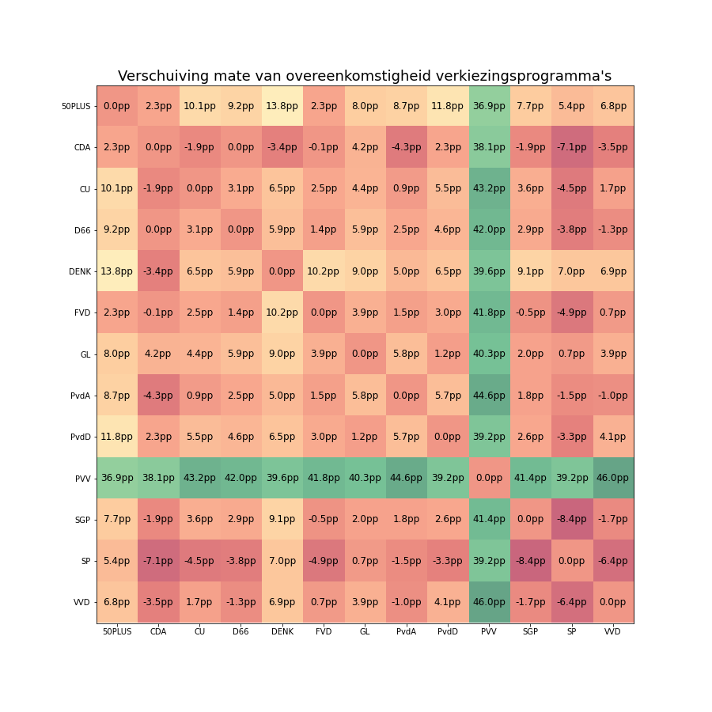

# De ChristenUnie is de ultieme middenpartij. Verkiezingsvocabulaire vergeleken

_Jan van Casteren_

In de aanloop naar de Tweede Kamerverkiezingen hebben de deelnemende politieke partijen hun verkiezingsprogramma’s gepresenteerd. Ik heb onderzocht in hoeverre verschillende partijen in hun programma’s dezelfde woorden gebruiken. Hiervoor heb ik technieken gebruikt uit Text Mining, het vakgebied op het snijvlak tussen Kunstmatige Intelligentie en Taalwetenschap. <a href="verkiezingsvocabulaire-vergeleken.pdf" target="_blank">Het gehele onderzoeksverslag vindt u hier.</a> Ik zal de gedane observaties die het meest in het oog springen kort samenvatten. Daarna laat ik de belangrijkste tabellen uit het onderzoek zien en licht ik deze kort toe.

## Samenvatting

De ChristenUnie is qua taal de ultieme middenpartij van deze verkiezingen. Het verkiezingsprogramma van CU komt gemiddeld het meest overeen met die van de overige partijen; daarnaast is de CU voor liefst zes medepartijen het meest nabij gelegen. D66 is een goede tweede middenpartij; D66 heeft de op-één-na-hoogste gemiddelde overeenkomst en is tevens voor vier partijen het meest nabij gelegen.

Het vocabulaire van de PVV is het meest eigen, gevolgd door resp. 50PLUS en FVD. Relatief nieuwe partijen zijn over het algemeen minder boodschapvast: ten opzichte van 2017 hebben PVV, 50PLUS, DENK en FVD de grootste verandering in taal doorgemaakt. De SGP is juist een baken van vasthoudendheid, net als D66, CU en de PvdD.
Partijen die voor de eeuwwisseling zijn opgericht zijn gemiddeld genomen consistenter. Daarnaast liggen deze partijen meer in het midden. 

Ten opzichte van de vorige Tweede Kamerverkiezingen zijn SP en CDA meer hun eigen verhaal gaan vertellen. Met minder goede wil zou men kunnen stellen dat deze partijen meer op een eiland zijn beland. 50PLUS en DENK laten een tegenovergestelde beweging zien, en staan t.o.v. de vorige verkiezingen juist beduidend meer in het talige centrum.
Verder interessant is de toegenomen overeenkomst van de VVD met de PvdD en GroenLinks; de "GroenRechts"-agenda van de VVD lijkt te zijn afgestoft. Ook is er sprake van een zekere mate van verwijdering tussen de coalitiepartijen.

CU en D66 hebben sinds 2017 hun middenposities (nog) verder verstevigd. In 2017 was CU voor vier partijen de meest nabij gelegen partij, nu noteert de CU er zes. Voor D66 waren dit er drie, nu vier.

Tot slot: het valt op dat de deelnemende partijen ten opzichte van 2017 in toenemende mate dezelfde taal zijn gaan hanteren. Het stempel dat door COVID-19 op de verkiezingen wordt gedrukt, zou hieraan ten grondslag kunnen liggen. Het zou echter ook het geval kunnen zijn dat de partijen simpelweg naar elkaar toe zijn bewogen.

<a href="verkiezingsvocabulaire-vergeleken.pdf" target="_blank">Hier</a> kunt u eventueel meer te weten komen over bovengenoemd onderzoek.

## Toelichting

Aan de hand van vier figuren zal ik kort toelichten waarop bovenstaande observaties zijn gebaseerd. Als eerst laat ik zien in welke mate de woordenschat van de verschillende partijen overeen komt. Vervolgens bespreek ik voor iedere partij de gemiddelde overeenkomstigheid met de overige partijen. Als derde toon ik in hoeverre de verschillende partijen hetzelfde woordgebruik hanteren als in hun vorige verkiezingsprogramma uit 2017. Tot slot zal ik laten zien op welke manier de overeenkomsten tussen de verschillende partijen ten opzichte van 2017 zijn veranderd.

### Mate van overeenkomstigheid

De volgende figuur toont de mate van overeenkomstigheid qua vocabulaire tussen de verkiezingsprogramma's van politieke partijen.

Het verkiezingsprogramma van CU komt gemiddeld het meest overeen met die van de overige partijen; daarnaast is de CU voor liefst zes medepartijen het meest nabij gelegen. D66 is een goede tweede middenpartij; D66 heeft de op-één-na-hoogste gemiddelde overeenkomst en is tevens voor vier partijen het meest nabij gelegen.

### Gemiddelde overeenkomstigheid met andere partijen

In deze figuur ziet u de gemiddelde overeenkomstigheid van een partij ten opzichte van alle andere partijen.

Ook in deze figuur toont de ChristenUnie haar aard als middenpartij; deze partij noteert gemiddeld de grootste overeenkomst met de programma's van de overige partijen, gevolgd door D66. Het vocabulaire van de PVV is het meest eigen, gevolgd door 50PLUS en FVD.

### Consistentie

De volgende figuur laat zien in hoeverre partijen woord houden. In hoeverre hanteren partijen dezelfde woorden ten opzichte van het verkiezingsprogramma voor de verkiezingen van 2017?

Relatief nieuwe partijen zijn over het algemeen minder boodschapvast: ten opzichte van 2017 hebben PVV, 50PLUS, DENK en FVD de grootste verandering in taal doorgemaakt. De SGP is juist een baken van vasthoudendheid, net als D66, CU en de PvdD.
Partijen die voor de eeuwwisseling zijn opgericht zijn gemiddeld genomen consistenter.

### Transities

De laatste figuur laat zien in hoeverre de overeenkomstigheden tussen de programma's zijn veranderd ten opzichte van 2017.

Ten opzichte van de vorige Tweede Kamerverkiezingen zijn SP en CDA meer hun eigen verhaal gaan vertellen. Met minder goede wil zou men kunnen stellen dat deze partijen meer op een eiland zijn beland. 50PLUS en DENK laten een tegenovergestelde beweging zien, en staan t.o.v. de vorige verkiezingen juist beduidend meer in het talige centrum.
Verder interessant is de toegenomen overeenkomst van de VVD met de PvdD en GroenLinks; de "GroenRechts"-agenda van de VVD lijkt te zijn afgestoft. Ook is er sprake van een zekere mate van verwijdering tussen de coalitiepartijen.

## Tot slot

Bedankt voor uw tijd en aandacht.
Wie meer wil weten over dit onderzoek, vindt hier <a href="verkiezingsvocabulaire-vergeleken.pdf" target="_blank">hier</a> het gedetailleerde verslag.
